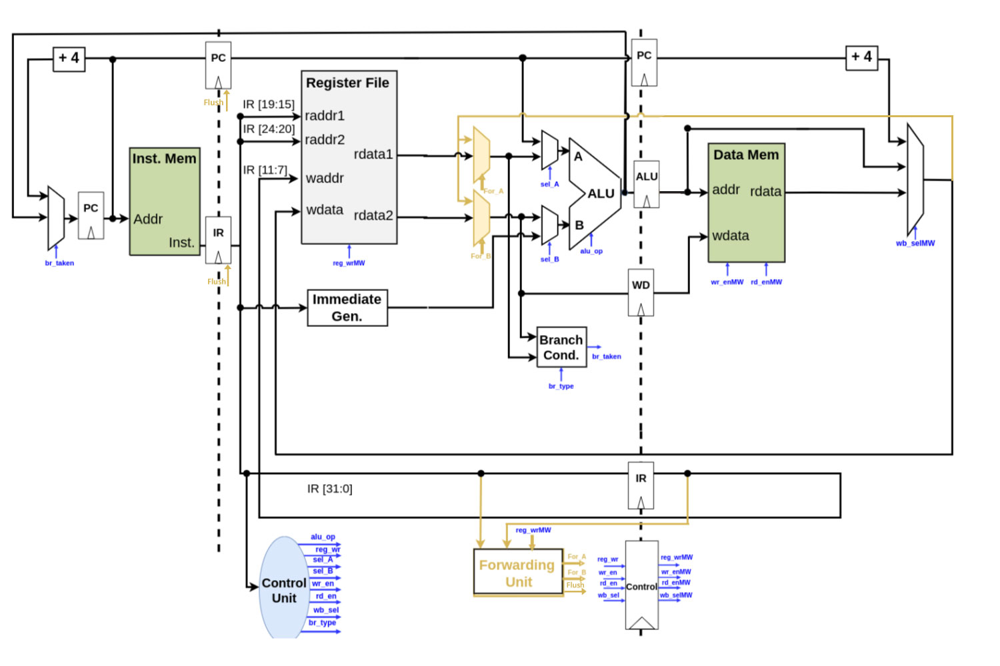

# 3 Stage Pipelined Processor RISC-V 32I

## Description
This project is a 3 stage pipelined processor of RISC-V base instruction architecture. The project has been made using systemverilog. The details of the processor design is as follows:

## Design
The design can be understood very easily through the diagram, but a verbose explanation is also given below.

### Top Module
The top module of the processor is the file `processor.sv` where an input of `clk` and `rst` are given to run the processor. All the modules and wiring is done in this file.

### Controller
The controller module is in the file `controller.sv`. It handles control singals for all types of instruction and CSR instructions as well.

### Instruction Fetching
Instruction fetching is done in modules `pc.sv`, `inst_mem.sv` and relevant multiplexers.

### Instruction Decoding
Instruction decoding takes place in the modules `inst_dec.sv`, `imm_gen.sv` and `reg_file.sv`.

### Execution
The execution is done in `alu.sv`, `branch_cond.sv` and relevant multiplexers.

### Memory Access and CSRs
The memory access stage is handled by `datamem.sv`, `csr_reg.sv` and relevant multiplexers.

### Writeback Stage
The writeback part of the processor is handled by `sel_wb_mux.sv` which is multiplexer for selecting what data to write back to the `reg_file.sv`.

### Pipeline Buffers
There are two buffers called `BUFFER_FD.sv` and `BUFFER_EM.sv`. `BUFFER_FD.sv` is placed between fetch and decode and it saves the information that needs to be retained between these two stages. `BUFFER_EM.sv` stores the data between execute and memory access stage.

## Diagram


## Compilation and Running
Before compiling, paste the machine code of your program in `inst.mem`.
Then, compile by opening the terminal in the directory and running:
```
vlog *.sv
```
Now, to run the simulation, run the following command:
```
vsim -c -voptargs=+acc tb_processor -do "run -all"
```
The simulation will run and all the code written in `tb_processor.sv` will run. If you want to observe any files in the code during simulation, make changes in `tb_processor.sv`.